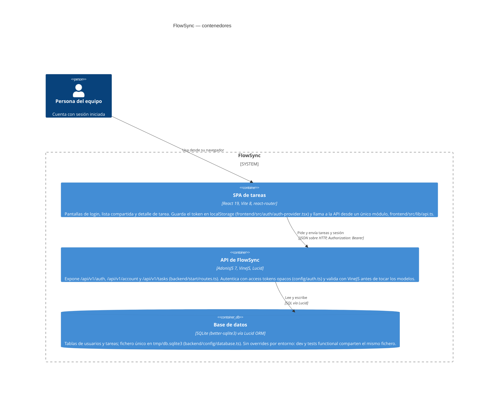

# Arquitectura — diagrama de contenedores (C4)

Diagrama de contenedores (nivel 2 de C4) de FlowSync, construido leyendo el código del
repo: las rutas de `backend/start/routes.ts`, la configuración de conexión de
`backend/config/database.ts`, y el punto de contacto único con la API en
`frontend/src/lib/api.ts`. Solo hay dos contenedores de aplicación —el SPA de React y la
API de AdonisJS— y un único almacén de datos, SQLite vía Lucid; no hay cola, caché,
servicio de email ni ninguna API de terceros en el código, así que no aparecen en el
diagrama.

