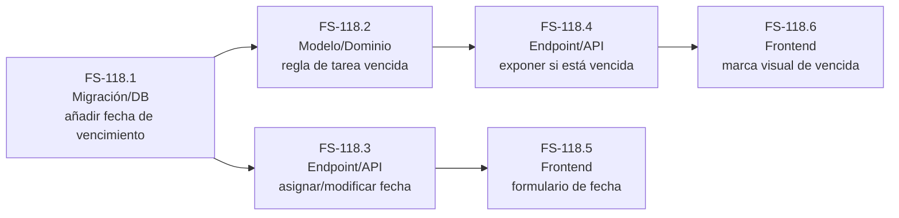

# Tickets — FS-118 «Fecha de vencimiento y tareas vencidas»

Descomposición de [`us-fechas-vencimiento.md`](./us-fechas-vencimiento.md) en unidades de trabajo. Cada ticket hereda los criterios de aceptación de la historia; su Definition of Done es una checklist de "cómo lo entregamos" (tests, manejo de error, convenciones), no criterios nuevos.

Nota de dependencia externa: todos estos tickets asumen que la creación/edición/listado básico de una tarea (título, responsable, estado) ya existe como capability de otra historia de E2.

## FS-118.1 — Migración/DB: añadir la fecha de vencimiento a la tarea

**Tipo:** Migración/DB
**Cubre:** base para todos los criterios de la historia
**Dependencias:** ninguna dentro de FS-118; depende de que la tarea ya exista como entidad.

**Definition of Done:**
- [ ] La migración corre limpia sobre datos ya existentes, sin perder tareas ni romper la carga de la app.
- [ ] El esquema generado queda actualizado y commiteado junto con la migración.
- [ ] No se ha editado a mano ningún archivo generado.
- [ ] El campo admite quedar sin valor (la historia exige que una tarea pueda no tener fecha).

## FS-118.2 — Modelo/Dominio: regla de "tarea vencida"

**Tipo:** Modelo/Dominio
**Cubre:** sin fecha, fecha pasada + no completada, fecha futura, fecha exactamente hoy, completada con fecha pasada, reprogramada a futuro tras estar vencida.
**Dependencias:** FS-118.1

**Definition of Done:**
- [ ] La regla de si una tarea está vencida vive en la capa de dominio/modelo, no en la vista ni en el controlador.
- [ ] Hay un test unitario por cada rama de la regla.
- [ ] La lógica es invocable y testeable sin pasar por una petición HTTP real.

## FS-118.3 — Endpoint/API: asignar y modificar la fecha de vencimiento

**Tipo:** Endpoint/API
**Cubre:** asignar fecha, modificarla, aceptar una fecha pasada sin rechazarla.
**Dependencias:** FS-118.1

**Definition of Done:**
- [ ] Test funcional que ejercita el endpoint real cubre: asignar fecha a una tarea sin fecha, modificarla, y aceptar una fecha pasada.
- [ ] Los errores de validación (si los hay) siguen el mismo formato de respuesta que el resto de la API existente.
- [ ] Solo un usuario autenticado puede modificar la fecha (reutiliza la protección de auth ya existente).
- [ ] No se ha añadido ninguna restricción no pedida por el criterio (p. ej., bloquear fechas pasadas).

## FS-118.4 — Endpoint/API: exponer si una tarea está vencida

**Tipo:** Endpoint/API
**Cubre:** tarea vencida, no vencida por fecha futura, no vencida por vencer justo hoy, consistencia tras completar/reprogramar.
**Dependencias:** FS-118.2

**Definition of Done:**
- [ ] El listado de tareas expone, para cada tarea, si está vencida según la regla de dominio de FS-118.2 (sin recalcularla de forma distinta en esta capa).
- [ ] Test funcional cubre al menos: una tarea vencida, una no vencida por fecha futura, y una no vencida por vencer justo hoy.
- [ ] El resultado se mantiene consistente si se completa la tarea o se le cambia la fecha entre una consulta y otra.

## FS-118.5 — Frontend: formulario para asignar/editar la fecha de vencimiento

**Tipo:** Frontend
**Cubre:** asignar fecha, modificarla, dejarla sin definir, aceptar una fecha pasada.
**Dependencias:** FS-118.3

**Definition of Done:**
- [ ] Probado manualmente en el navegador: crear tarea sin fecha, añadirle fecha después, modificarla, y guardar una fecha pasada sin que la UI la bloquee.
- [ ] Los errores que devuelva el backend se muestran al usuario de forma comprensible, con el mismo patrón que ya usan otros formularios del frontend.
- [ ] Usa los componentes de `src/components/ui/` ya existentes (shadcn), sin editarlos a mano.
- [ ] `npm run build` y `npm run lint` (oxlint) pasan sin errores nuevos.

## FS-118.6 — Frontend: distinguir visualmente las tareas vencidas en la lista

**Tipo:** Frontend
**Cubre:** marca visual de vencida, y su desaparición al completar o reprogramar.
**Dependencias:** FS-118.4

**Definition of Done:**
- [ ] Probado manualmente: una tarea vencida se distingue a simple vista de una que no lo está, sin necesidad de abrirla.
- [ ] Al completar una tarea vencida o reprogramarla a futuro, la marca de vencida desaparece sin recargar la página manualmente (coherente con el resto del listado, que ya se refresca solo).
- [ ] Usa los componentes de `src/components/ui/` existentes; sigue las convenciones visuales ya establecidas (Tailwind tokens de `src/index.css`).
- [ ] `npm run build` y `npm run lint` pasan sin errores nuevos.

## Grafo de dependencias

Una flecha `A → B` significa "A bloquea a B".

## Orden de implementación recomendado

1. **FS-118.1** (Migración/DB) — es la base; nada más puede avanzar sin el campo de fecha.
2. **FS-118.2** y **FS-118.3** en paralelo — ambas solo dependen de 118.1, y son de personas/capas distintas (dominio vs. API de escritura).
3. **FS-118.4** — depende de 118.2 (necesita la regla de "vencida" ya definida).
4. **FS-118.5** — depende de 118.3 (necesita el endpoint que acepta la fecha).
5. **FS-118.6** — depende de 118.4 (necesita que el listado ya exponga si una tarea está vencida).

Nota: 118.4 y 118.5 también podrían solaparse entre sí si hay dos personas, porque no dependen una de la otra — solo 118.6 tiene que esperar a que 118.4 esté cerrado.
