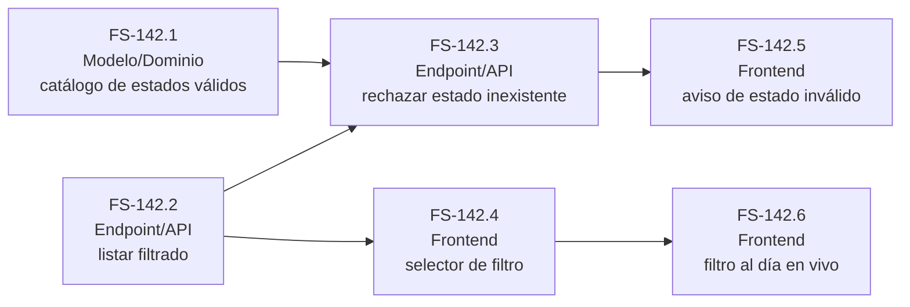

# Tickets — FS-142 «Filtrar tareas por estado»

Descomposición de [`us-filtrar-por-estado.md`](./us-filtrar-por-estado.md) en unidades de trabajo. Cada ticket hereda los criterios de aceptación de la historia; su Definition of Done es una checklist de "cómo lo entregamos" (tests, manejo de error, convenciones), no criterios nuevos.

Nota de dependencia externa: se asume que la tarea, su atributo de estado y el listado básico ya existen (de otra historia de E2); esta descomposición es solo sobre el filtrado.

## FS-142.1 — Modelo/Dominio: catálogo de estados válidos de una tarea

**Tipo:** Modelo/Dominio
**Cubre:** base necesaria para distinguir "estado válido sin resultados" de "estado que no existe".
**Dependencias:** ninguna dentro de FS-142; depende de que el atributo de estado ya exista en la tarea.

**Definition of Done:**
- [ ] Existe un único punto en el dominio que sabe cuáles son los estados válidos de una tarea (no se repite esa lista en varios sitios).
- [ ] Hay una función/regla de dominio testeable que responde si un valor dado es un estado válido o no, sin pasar por una petición HTTP.
- [ ] Test unitario cubre al menos un estado válido y uno inventado/no existente.

## FS-142.2 — Endpoint/API: listar tareas filtradas por un estado válido

**Tipo:** Endpoint/API
**Cubre:** filtrar por un estado con tareas, quitar el filtro, filtrar por un estado válido sin resultados.
**Dependencias:** ninguna dentro de FS-142 (usa el atributo de estado ya existente).

**Definition of Done:**
- [ ] Test funcional cubre: filtrar por un estado con tareas, quitar el filtro y recuperar todas, y filtrar por un estado válido sin ninguna tarea (lista vacía, no error).
- [ ] La respuesta distingue de forma consistente "sin resultados" de un error, siguiendo el mismo patrón que ya usa el resto de la API.
- [ ] Solo un usuario autenticado puede consultar el listado (reutiliza la protección de auth ya existente).

## FS-142.3 — Endpoint/API: rechazar el filtrado por un estado inexistente

**Tipo:** Endpoint/API
**Cubre:** aviso de error cuando se pide un estado que no existe, en vez de una lista vacía silenciosa.
**Dependencias:** FS-142.1, FS-142.2

**Definition of Done:**
- [ ] Test funcional pide el listado filtrando por un valor que no es un estado válido y verifica que la respuesta comunica un error, no una lista vacía.
- [ ] El error usa el mismo formato de comunicación de errores que ya emplea el resto de la API.
- [ ] No se han inventado nuevos estados válidos ni se ha relajado la validación de FS-142.1 para "dejar pasar" el caso.

## FS-142.4 — Frontend: selector para filtrar y quitar el filtro por estado

**Tipo:** Frontend
**Cubre:** aplicar un filtro con resultados, aplicar uno sin resultados, quitar el filtro.
**Dependencias:** FS-142.2

**Definition of Done:**
- [ ] Probado manualmente: aplicar un filtro con resultados, aplicar uno sin resultados (se distingue de un error) y quitar el filtro para ver todas las tareas de nuevo.
- [ ] Usa los componentes de `src/components/ui/` ya existentes (shadcn), sin editarlos a mano.
- [ ] `npm run build` y `npm run lint` (oxlint) pasan sin errores nuevos.

## FS-142.5 — Frontend: aviso de estado inválido y [propuesto] recuperación del filtro anterior

**Tipo:** Frontend
**Cubre:** aviso comprensible ante un estado inválido (CA-4, aprobado), y [condicional a CA-5] recuperación del último filtro válido al descartarlo.
**Dependencias:** FS-142.3

**Definition of Done:**
- [ ] Probado manualmente: forzar un filtro con un estado inexistente muestra un aviso comprensible al usuario, no una lista vacía silenciosa.
- [ ] El aviso sigue el mismo patrón visual que ya usan otros errores del frontend (mismo componente/estilo, no uno nuevo ad hoc).
- [ ] **[Condicional a CA-5]** Si CA-5 se aprueba: al descartar ese aviso, la lista vuelve al último filtro válido (o a "todas las tareas" si no había ninguno aplicado), nunca se queda en blanco. Hasta entonces, este punto no es una obligación ejecutable del ticket.

⚠️ Dependencia de producto: CA-5 está marcado `[PROPUESTA]` en la historia. No implementar el comportamiento de recuperación del filtro como regla definitiva hasta que ese criterio sea aprobado; la parte del aviso de error (CA-4) sí es aprobada y ejecutable de forma independiente.

## FS-142.6 — Frontend: mantener el filtro activo al día con cambios en vivo

**Tipo:** Frontend
**Cubre:** que una tarea nueva o modificada aparezca/desaparezca del filtro activo sin reaplicarlo a mano.
**Dependencias:** FS-142.4

**Definition of Done:**
- [ ] Probado manualmente: con un filtro activo, crear una tarea o cambiar el estado de una existente hace que aparezca/desaparezca de la lista filtrada sin quitar y reaplicar el filtro a mano.
- [ ] No introduce un mecanismo de actualización distinto al que ya usa el resto del listado (reutiliza el mismo patrón de refresco, no crea uno paralelo solo para la vista filtrada).
- [ ] `npm run build` y `npm run lint` pasan sin errores nuevos.

## Grafo de dependencias

Una flecha `A → B` significa "A bloquea a B".

## Orden de implementación recomendado

1. **FS-142.1** (Modelo/Dominio) — catálogo de estados válidos.
2. **FS-142.2** (Endpoint/API) — listar filtrado; no depende de 142.1, puede ir en paralelo.
3. **FS-142.3** y **FS-142.4** en paralelo — ambas dependen de 142.2 (y 142.3 también de 142.1).
4. **FS-142.5** y **FS-142.6** en paralelo — dependen de 142.3 y 142.4 respectivamente.
